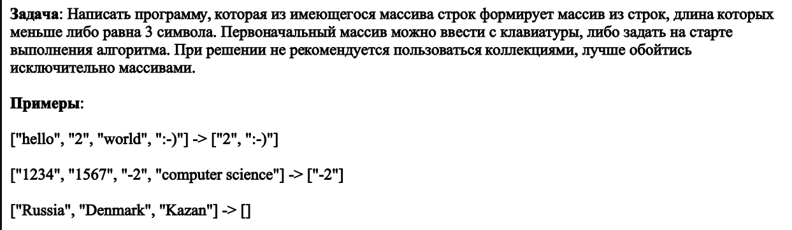

# Прооверочная работа

## Поставленная задача

## Описание решения

### Вввод

При начале исполнения программы у пользователя заправшивается хочет ли он ввести данные самостоятельно или воспользоватся заранее сгенерированными данными.

В зависимости от выбора пользователя:

- в основной блок будет передан заранее сгенерированный массив;
- пользователю будет предложенно ввести данные, разделяя ввод пробелами.

>В случае, если отдельные слова (строки) пользователь не разделит пробелами - програмам засчитает их как одно слово.

>При выборе варианта с использованием заранее сгенерированного массива - пользователю показывается данный массив (происходит печать его в консоль).

### Обработка ввода
После того, как ввод пользователя получен (либо выбран вариант с использованием данных "по умолчанию") и данные внесены в массив - данный массив поступает на дальнейшую обработку.

С использованием цикла - в переданном массиве происходит поиск строк, длинна которых равна 3 символам или менее. Все строки, удовлетворяющие данному условию - вносятся в новый массив, который является итоговым.

### Вывод
По завершению процесса обработки - пользователю выводится итоговый массив, содержащий результаты, удовлетворяющие требуемому условию.

>в случае, если заданному условию не удовлетворяет ни один элемент переданного массива - пользователю выводится пустой массив

*Дата составления: 11.09.22*